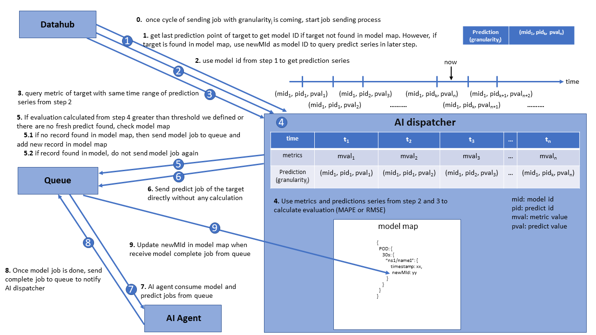

# Overview

AI dispatcher is responsible to send two kind of jobs model and predict to queue which is consumed by AI agents.
Each kind of job with different granularities, 30s, 1h, 6h, and 24h, will be sent to queue seperately. By default,
AI dispatcher sends model and predicted jobs to queue cyclely according to it's granularity. For example, model job of
the pod with granularity 30s will be sent to queue every 30s. We can set environment variable
**_ALAMEDA_AI_DISPATCHER_GRANULARITIES_30S_PREDICTIONJOBSENDINTERVALSEC_** and
**_ALAMEDA_AI_DISPATCHER_GRANULARITIES_30S_MODELJOBSENDINTERVALSEC_** to change sending cycle.

# Drift Evaluation

AI dispatcher tries to list all predicted targets (ex: pod, node, gpu, namespace, application, cluster,
and controller) at startup and then sends their own jobs to queue.
Due to model job is time wasting, we reuse training model by evaluating their predicted precision via MAPE or RMSE. If
target has no fresh prediction or it's MAPE or MESE is greater than threshold, model job is sent to queue. **_ALAMEDA_AI_DISPATCHER_MEASUREMENTS_MAPE_THRESHOLD_** and **_ALAMEDA_AI_DISPATCHER_MEASUREMENTS_RMSE_THRESHOLD_** are
environment variables used to set threshold of MAPE and RMSE. **Default evaluation policy is MAPE**, we can change
this by setting environment variable **_ALAMEDA_AI_DISPATCHER_MEASUREMENTS_CURRENT_**.

It is worth mentioning that the number of data points _n_ is dynamic which means how many times the model is reused.
The more times model is reused, the larger _n_ is gotten. To prevent incorrect evaluation, we set minimum
value of _n_ to 5. This parameter is configurable by environment variable **_ALAMEDA_AI_DISPATCHER_MEASUREMENTS_MINIMUMDATAPOINTS_**.

# Job type sending customization

We provide **_ALAMEDA_AI_DISPATCHER_SERVICESETTING_GRANULARITIES_** and
**_ALAMEDA_AI_DISPATCHER_SERVICESETTING_PREDICTUNITS_** to control what kind of job can be sent. If users want to
predict some targets with some granularties they are interested in (ex: application and namespace with granularities 30s and 1h),
they can set **_ALAMEDA_AI_DISPATCHER_SERVICESETTING_GRANULARITIES="30s 1h"_** and
**_ALAMEDA_AI_DISPATCHER_SERVICESETTING_PREDICTUNITS="APPLICATION NAMESPACE"_**.

# MAPE and RMSE

## MAPE

The **MAPE (mean absolute percentage error)** equation is as following, pt is the predicted value at time t,
mt is the metric value at time t, and n is the number of data points used to calculation.
pt-pt-1 or mt-mt-1 is the granularity.

As the equation shows if mt is small, the result is to be large easily.

## RMSE

The **RMSE (root-mean-square error)** equation is as following, pt is the predicted value at time t,
mt is the metric value at time t, and n is the number of data points used to calculation. _normalize_
is used to normalize.

Normalized value of cpu, memory, and gpu can be set by environment varaibles **_ALAMEDA_AI_DISPATCHER_MEASUREMENTS_RMSE_NORMALIZATION_CPU_**
with unit millicores, **_ALAMEDA_AI_DISPATCHER_MEASUREMENTS_RMSE_NORMALIZATION_MEMORY_** with unit bytes, and
**_ALAMEDA_AI_DISPATCHER_MEASUREMENTS_RMSE_NORMALIZATION_DUTYCYCLE_** with unit duty cycle.

Environment Variable                                                  | Default Value
----------------------------------------------------------------------|-------------------------------------------------------|
ALAMEDA_AI_DISPATCHER_MEASUREMENTS_MAPE_THRESHOLD                     | 15                                                    |
ALAMEDA_AI_DISPATCHER_MEASUREMENTS_RMSE_THRESHOLD                     | 10                                                    |
ALAMEDA_AI_DISPATCHER_MEASUREMENTS_CURRENT                            | mape                                                  |
ALAMEDA_AI_DISPATCHER_MEASUREMENTS_RMSE_NORMALIZATION_CPU             | 1                                                     |
ALAMEDA_AI_DISPATCHER_MEASUREMENTS_RMSE_NORMALIZATION_MEMORY          | 1000000                                               |
ALAMEDA_AI_DISPATCHER_MEASUREMENTS_RMSE_NORMALIZATION_DUTYCYCLE       | 0.2                                                   |
ALAMEDA_AI_DISPATCHER_MEASUREMENTS_MINIMUMDATAPOINTS                  | 5                                                     |
ALAMEDA_AI_DISPATCHER_SERVICESETTING_GRANULARITIES                    | 30s 1h 6h 24h                                         |
ALAMEDA_AI_DISPATCHER_SERVICESETTING_PREDICTUNITS                     | POD GPU NAMESPACE APPLICATION CLUSTER CONTROLLER NODE |
ALAMEDA_AI_DISPATCHER_GRANULARITIES_24H_PREDICTIONJOBSENDINTERVALSEC  | 86400                                                 |
ALAMEDA_AI_DISPATCHER_GRANULARITIES_6H_PREDICTIONJOBSENDINTERVALSEC   | 21600                                                 |
ALAMEDA_AI_DISPATCHER_GRANULARITIES_1H_PREDICTIONJOBSENDINTERVALSEC   | 3600                                                  |
ALAMEDA_AI_DISPATCHER_GRANULARITIES_30S_PREDICTIONJOBSENDINTERVALSEC  | 30                                                    |
ALAMEDA_AI_DISPATCHER_GRANULARITIES_24H_MODELJOBSENDINTERVALSEC       | 86400                                                 |
ALAMEDA_AI_DISPATCHER_GRANULARITIES_6H_MODELJOBSENDINTERVALSEC        | 21600                                                 |
ALAMEDA_AI_DISPATCHER_GRANULARITIES_1H_MODELJOBSENDINTERVALSEC        | 3600                                                  |
ALAMEDA_AI_DISPATCHER_GRANULARITIES_30S_MODELJOBSENDINTERVALSEC       | 30                                                    |
ALAMEDA_AI_DISPATCHER_HOURLYPREDICT                                   | false                                                 |

# Deduplicate jobs in queue

Each jobs sents to queue are encoded an unique message id. Each job will be drop if there is already the same message id
of job is in the queue. Message ID of pod is encoded as **_namespace/name/granularity_**, node as **_name/granularity_**,
and gpu as **_host/minor number/granularity_**.

# Metrics Export

We export some metrics to prometheus server to evaluate drift performance. [Metrics exported](https://github.com/containers-ai/alameda/blob/master/ai-dispatcher/docs/alameda-ai-dispatcher-metrics.md#list-of-metrics-exported-by-alameda-ai-dispatcher) are model time, total model time,
MAPE, RMSE, and total drift time. Ensure service monitoring is applied as the
[tutorial](https://github.com/containers-ai/federatorai-operator/blob/master/docs/setmetrics.md#apply-ai-dispatcher-service-monitoring).
