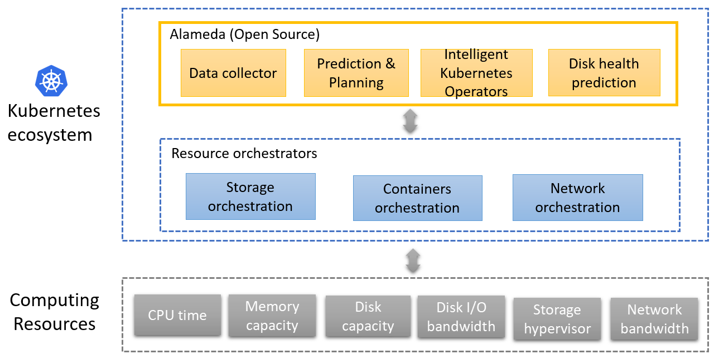
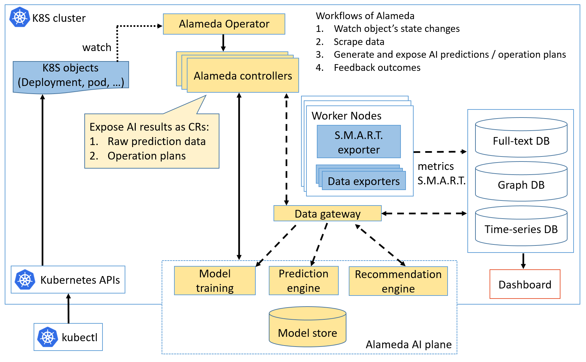

## What is Alameda

Alameda provides AI-driven resource orchestration intelligence for Kubernetes. More specifically, it provides the intelligence for autonomous balancing, scaling, and scheduling by using machine learning. Alameda learns the continuing changes of computing resources from Kubernetes clusters, predicts the future computing resources demands of pods, and generates resource configuration recommendation for intelligently orchestrating the underlying computing resources without manual configuration.

## Features

The primary purpose of Alameda is to recommend optimal computing resource configuration for Kubernetes by utilizing AI-powered prediction capability. With this, IT admins can leave one of the hardest problems of running Kubernetes to Alameda. Features of Alameda include:

- AI-driven resource management for CPU, memory, and disks  
    Alameda AI Engine generates loading data prediction for the future time. The AI Engine learns patterns from the historical performance metrics of each node and pods running on it. For example, it predicts CPU metrics of the next 24 hours in 1-hour interval. Besides future performance metrics, Alameda also detects disk health and predicts life expectancy based on a disk's S.M.A.R.T. value. With these predicted metrics and data, Alameda optimizes resource provisioning for Kubernetes.

- Integral scaling considerations  
    When managing Kubernetes clusters, IT admins usually need to take care of how much resources are required by each pod, when a pod needs to scale up/down replicas and when a cluster needs to scale up/down a node. Though several autoscalers such as [VPA](https://github.com/kubernetes/autoscaler/tree/master/vertical-pod-autoscaler), [HPA](https://kubernetes.io/docs/tasks/run-application/horizontal-pod-autoscale/), and [CA](https://github.com/kubernetes/autoscaler/tree/master/cluster-autoscaler) are introduced in Kubernetes, they work reactively and independently. Even more, scaling outcomes might not be desirable due to contradictory settings by humans. With Alameda, all these scaling considerations are taken into one integrated global planning.

- Policy-driven optimization  
    Alameda provides *stable* and *cost-saving* policies for users to orchestrate resources. With the *stable* policy, users can expect more available resources reserved on each node, which could effectively reduce pod restarting due to insufficient resources for the pods. With *cost-saving* policy, users can expect less running nodes, which could effectively reduce operational spending. This policy-based optimization simplifies resource management complexity. 

- Well integrated into a Kubernetes cluster  
    Alameda exposes metrics prediction and operation recommendations via Kubernetes' [CRDs](https://kubernetes.io/docs/concepts/extend-kubernetes/api-extension/custom-resources/). Anyone can leverage these to build up their extensions.

## Architecture of Alameda

As showed in the following figure, Alameda is integrated into the Kubernetest ecosystem as the brain of resource orchestration and cooperates with Kubernetes orchestrators by providing metric predictions and resource configuration recommendations.

## How Alameda works

Alameda works in the following flows:

1. Users specifying objects that need Alameda services by creating Alameda CRD objects. For example, to request Alameda services for a *Deployment* object, users can create an Alameda CRD object as the following yaml:
    <pre>
        apiVersion: containers.ai/v1beta1
        kind: Deployment
        metadata:
          <b>annotations:
            containers.ai/autoscale: true
            containers.ai/diskFailurePrediction: true
            containers.ai/capacityTrendingPrediction: true</b>
        spec:
          <b>selector:
            matchLabels:
              app: user-defined-deployment-app-name</b>
    </pre>
2. Alameda watches creation, update, and deletion of the specified targets
3. Alameda leverages Prometheus to scrape data, and these data are adapted into Alameda plane
4. Alameda's AI engine predicts computing resource demands
5. Alameda exposes prediction raw data
6. Alameda generates operational plans based on the prediction for further automation
7. Third party projects can automate resource orchestrations by either leveraging Alameda recommended operational plans or predicted metrics
8. Alameda has a feedback mechanism to evaluate the operating results for further refinement

## Usecase illustration

As the following figure, users specify objects that required Alameda services and configure Alameda with a preferred policy. Then Alameda exposes the raw predicted metrics for the specified objects and nodes. Recommendations are also generated and bundled for all objects managed by Alameda.

