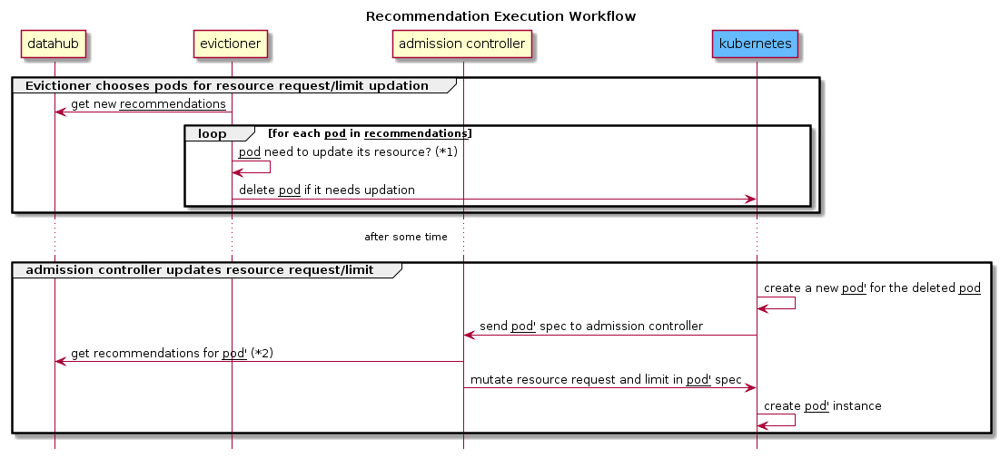
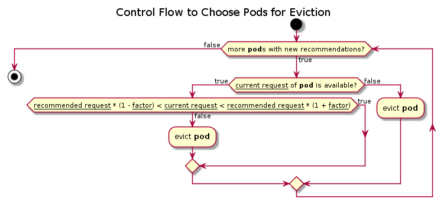
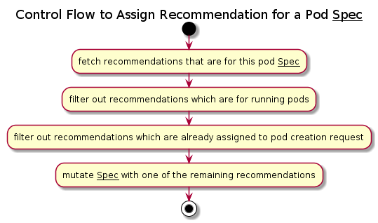

# Execution of Alameda Recommendations

The execution of Alameda recommendations consists of two components which are evictioner and admission controller. The function of these collaborated components are:
- **Evictioner**  
  Evict pods that need to update their resource request and limit
- **Admission Controller**  
  Alameda follows Kubernetes [dynamic admission control](https://kubernetes.io/docs/reference/access-authn-authz/extensible-admission-controllers/) framework to intercept requests prior to pod creation for resource request and limit mutating.


The above figure depicts the workflow of Alameda execution. The excution of an Alameda recommendation is implemented in two steps. The first step is to evict pods that has new recommendations. Then Kubernetes controller will try to reconcile pod numbers to its desire numbers. Since Alameda registered a webhook for the pod creation handling at this stage, Alameda *admission controller* will be invoked at this point to mutate the pod spec with recommended resource request and limit.

The decision function ```pod need to update its resource?``` in the eviction workflow is explained as follows:  
  
The motivation is trying to reduce the unnecessary restart times as many as possible. Therefore only the recommended request that is larger than current setting by a *factor* is chosen for updation.

> **Note**: the function only compares request values because it is the key value to schedule pods.

> **Note**: The default *factor* is set to 1% for cpu and 1% for memory resource. To change the default value, please set the environment variable ```EVICTIONER.TRIGGER.THRESHOLD.CPU``` and ```EVICTIONER.TRIGGER.THRESHOLD.MEMORY``` to the desired value before running the evictioner image.

The function ```get recommendations for pod'``` is explained as following control diagram. Kubernetes invokes Alameda admission controller with pod spec for spec mutation. By looking into the pod spec, Alameda admission controller looks for the farest K8s object that this pod spec is derived from. For example, a *deployment* K8s object derives a *replicaset* object and this *replicaset* object derives *pod* objects. In this example, Alameda admission controller will find the *deployment* object and use it to query recommendations for the derived pod spec. Since a *deployment* object may derive several pods with the same pod spec, Alameda admission controller needs to find the right recommendation for an incoming pod creation request.
  


